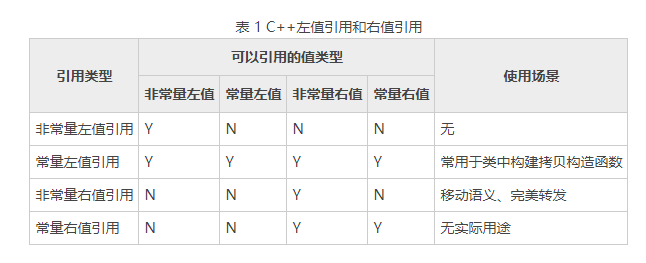

web to find information:

[169IT-最新,最全的IT科技,数码,互联网,编程,创业等资讯汇集网站](https://www.169it.com/)

https://www.runoob.com/cplusplus

#### stl

stl有PJ STL,RW STL,SGI STL等版本，实现可能不同，接口相同

GCC主要用的是修改的SGI STL，可读性较高

其中含有6个要素：空间配置器，容器，迭代器，算法，仿函数，容器适配器

空间适配器：特性萃取机制


13个库

| <iterator> | <functional> | <vector>  | <deque>  |
| ---------- | ------------ | --------- | -------- |
| <list>     | <queue>      | <stack>   | <set>    |
| <map>      | <algorithm>  | <numeric> | <memory> |
| <utility>  |              |           |          |

##### 容器

序列式：list，vector，deque

关联式：set，map，multiset，multimap，hash_set，hash_map

容器适配器：stack，queue

###### list

头节点不存元素，head指向头，一般为循环

```
#include <iostream>
#include <list>
using namespace std;
signed main(){
    int ar[10] = { 1,2,3,4,5,6,7,8,9,10 };
    list<int>L(ar,ar+10),L2=L;
    L.swap(L2);//交换两个链表
    auto traverse = [](list<int>& L) {
        list<int>::iterator it = L.begin();
        while (it != L.end()) {
            cout << *it << " ";
            it++;
        }cout << endl;
    };
    auto cmp = [](int x, int y) {
        return x > y;
    };
    auto is = [](int x) {
        return x==1;
    };
    L.empty();//是否为空
    L.size();//现在大小
    L.max_size();//可容大小
    L.front(); L.back();//值
    L.begin(); L.end(); L.rbegin(); L.rend();//迭代器
    L.push_back(1);L.push_front(1);//前后插入
    L.pop_back();L.pop_front();//前后删除
    L.insert(L.begin(),1,1);//插入迭代器前面,iterator,value,num
    L.erase(L.begin());L.erase(L.begin(),L.end());//删除迭代器区间
    L.assign(10, 1);//覆盖为长度为10，全为1的list
    L.reverse();
    L.sort(cmp);
    L.unique();
    L.splice(L.begin(),L2);//把L2拼接到L.begin()前面，L2元素删除完
    L.merge(L2);
    traverse(L);
    L.remove(1);//删除所有1元素
    L.remove_if(is);//删除条件内的元素
    L.get_allocator();//返回内存分配器对象
    traverse(L);
    L.clear();
    return 0;
}
```

##### 迭代器

begin()，end()：正序迭代器(list<>::iterator)

rbegin()，rend()：逆序迭代器(list<>::reverse_iterator) rbegin为容器最后一个迭代器

迭代器本身也是一个类，具有比较是否相同，如何加加，如何减减 如何取值等操作，每种数据结构可以构造一个迭代器，得到begin等返回值

##### algorithm

非变异算法：数据不发生改变的算法

变异算法 ：数据发生改变的算法

find，count，copy，copy_backward，replace，remove，fill，reverse，sort

```
#include <bits/stdc++.h>
using namespace std;
int cmp(const void *e1,const void *e2){//>0交换
    return (*(int*)e1)-(*(int*)e2);
}
signed main(){
    int ar[10]={1,2,3,4,5,6,7,8,9,10};
    vector<int>a(ar,ar+10);
    vector<int>b(10);
    int n=10;
    int t=101;
    find(a.begin(),a.end(),t);//找到返回iterator,否则返回a.end()
    count(a.begin(),a.end(),t);//返回t的数量
    for_each(a.begin(),a.end(),[](int &x){
        x=x*x;
    });//枚举对每位操作=>1,4,9,16...
    copy(a.begin(),a.end(),b.begin());//从前面开始拷贝，结果是1,4,9,16...
    copy_backward(a.begin(),a.end(),b.end());//从后面开始拷贝，结果还是1,4,9,16...
    replace(a.begin(),a.end(),1,t);//把所有1换成t
    remove(a.begin(),a.end(),t);//把t都删除，后面的数往前移，a.size()不会变，后面的数据保留原数组最后的数据，返回删除后补全前位置迭代器
    fill(a.begin(),a.end(),1);//填充1
    reverse(a.begin(),a.end());//反转
    sort(a.begin(),a.end(),[](int x,int y){//排序
        return x>y;
    });
    sort(a.begin(),a.end(),greater<int>());
    qsort(ar,n,sizeof(int),[](const void *e1,const void *e2){//快速排序,基本库的，不是algorithm的
        return (*(int*)e1)-(*(int*)e2);//>0交换
    });
    for (int i=0;i<10;i++)cout<<ar[i]<<" ";
    return 0;
}
```

##### 仿函数

发生器(无参数)，一元仿函数(一个参数)，...

greater<int>()  less<int>()  ...

函数对象代替函数指针 op.operator()

```
#include<functional>
#include<iostream>
using namespace std;
template <class _Ty = void>
struct op{
    constexpr _Ty operator()(const _Ty& _Left, const _Ty& _Right) const {
        return _Left + _Right;
    }
};
signed main(){
    op<int>ps;
    cout<<ps(1,2)<<endl;
    return 0;
}
```

#### lambda表达式

```
class A
{
    public:
    int i_ = 0;
    void func(int x, int y)
    {
        auto x1 = []{ return i_; };                    // error，没有捕获外部变量
        auto x2 = [=]{ return i_ + x + y; };           // OK，捕获所有外部变量
        auto x3 = [&]{ return i_ + x + y; };           // OK，捕获所有外部变量
        auto x4 = [this]{ return i_; };                // OK，捕获this指针
        auto x5 = [this]{ return i_ + x + y; };        // error，没有捕获x、y
        auto x6 = [this, x, y]{ return i_ + x + y; };  // OK，捕获this指针、x、y
        auto x7 = [this]{ return i_++; };              // OK，捕获this指针，并修改成员的值
    }
};
int a = 0, b = 1;
auto f1 = []{ return a; };               // error，没有捕获外部变量
auto f2 = [&]{ return a++; };            // OK，捕获所有外部变量，并对a执行自加运算
auto f3 = [=]{ return a; };              // OK，捕获所有外部变量，并返回a
auto f4 = [=]{ return a++; };            // error，a是以复制方式捕获的，无法修改
auto f5 = [a]{ return a + b; };          // error，没有捕获变量b
auto f6 = [a, &b]{ return a + (b++); };  // OK，捕获a和b的引用，并对b做自加运算
auto f7 = [=, &b]{ return a + (b++); };  // OK，捕获所有外部变量和b的引用，并对b做自加运算
function<void(int)> DfsB = [&](int v) {
    pos_b[v] = (int) order_b.size();
    order_b.push_back(v);
    for (int u : gb[v]) {
    	DfsB(u);
    }
    end_b[v] = (int) order_b.size() - 1;
};
```

#### 类

##### 关键词

explicit：只允许显式转换(也叫强制转换)，不允许隐式转换。可在类的构造函数前加explicit表示只能显式转换。

##### 构造函数和析构函数

构造函数

```
Line(){len=0;}
void setLength(double len){length=len;}//先任意初始化，之后可以用其他函数赋值
Line(double len){length=len;}//参数初始化
Line(double len):length(len){}//初始化列表来初始化字段

//不加前以下都可以，加了explicit后
Line line(20.0);//ok
Line line2=line;//ok
Line line3={20.0};//no way!
Line line4=Line(20.0);//ok
```

析构函数

```
~Line(){}
```

##### 运算重载

```
bool operator ==(const const_iterator& _X) const {
	return _Ptr == _X._Ptr;
}
```

##### 模板

template<class T>

注意事项：

1.模板声明只允许在全局、命名空间或类范围内使用！故不能在main函数中直接定义。

2.若构造的类为模板类，那么派生类不可以直接使用继承到的基类数据和方法，需要通过this指针使用。否则，在使用一些较新的编译器时，会报“找不到标识符”错误。

3.如果父类自定义了构造函数，记得子类要使用构造函数列表来初始化
继承的时候，如果子类不是模板类，则必须指明当前的父类的类型，因为要分配内存空间
继承的时候，如果子类是模板类，要么指定父类的类型，要么用子类的泛型来指定父类 


4.在编译器进行编译的时候，编译器会产生类的模板函数的声明，当时实际确认类型后调用的时候，会根据调用的类型进行再次帮我们生成对应类型的函数声明和定义，经常报错找不到类的函数的实现。解决方法：进行类的前置声明和函数的前置声明 。

5.声明和定义不在同一个文件的问题。模板的声明是在.h文件，定义是在.cpp文件，因编译时只产生声明的代码，故编译不会出错，但是当调用时会产生找不到类或者函数的问题，

解决方法：1、将模板的声明和定义放在同一个文件中

　　　　  2、主函数中调用#include<.cpp>或者将.cpp文件改为.hpp文件再引用

##### 异常处理

assert(bool)//如果不对则会报错


#### 编写标准

只在类内部使用的类型、变量前加_

using A=B;//别名

#### 类型范围

```
cout<<"long double: \t"<<"所占字节数："<<sizeof(long double);  
cout<<"\t最大值："<<(numeric_limits<long double>::max)();
cout<<"\t最小值："<<(numeric_limits<long double>::min)() << endl;  
```

浮点数存储IEEE 754浮点标准

$V=(-1)^SM*2^E$


#### 右值引用

lvalue 是“loactor value”的缩写，可意为存储在内存中、有明确存储地址（可寻址）的数据，而 rvalue 译为 "read value"，指的是那些可以提供数据值的数据（不一定可以寻址，例如存储于寄存器中的数据）。

右值引用就是将临时变量或对象偷过来作为长周期对象存在，避免不必要的多次销毁。

函数内定义的变量是将亡值，将将亡值赋值给常量会使将亡值存活到常量的周期结束

常用于移动语义和完美转发


```
int num = 10;
int &b = num; //正确
int &c = 10; //错误
int num = 10;
const int &b = num;//C98允许常量右值引用
const int &c = 10;
int && a = 10;//&&表示右值引用
a = 100;

移动语义
构造函数 自己给自己赋值时可以加上&&
int main() {
	Test reusable;
	Test duplicated(std::move(reusable));//移动构造函数，左值转为右值，后面reusable将被变为空指针
}
完美转发
template <typename T>
void func(T t) {
    cout << "in func " << endl;
}
template <typename T>
void relay(T&& t) {
    cout << "in relay " << endl;
    func(std::forward<T>(t));//以原左右值形式转发，
}

```



#### if造成的问题

编译器处理代码是流水线处理的，if语句先会猜一个值，然后猜错了会删除已经编译了的话重新编译这段话，造成时间的减慢。

if也会导致SIMD(Single Instruction Multiple Data)优势缺失，SIMD可以使得64位寄存器同时处理16个4位二进制等情况。

```
int S1(int v){//原表达式
	if (v<10)return v+48;
	else return v+55;
}
int S2(){
	return v+(v<10?48:55);
}
int S3(){
	//return v+55-(c&7);c=v<10?-1:0=-(v<10)
	return v+55-((-(v<10))&7);
}
int S4(){
	return v+55-(((v-10)>>15)&7);
}
```

```
int abs1(int n){
	if (n>=0)return n;
	else return -n;
}
int abs2(int n){
	//-n=~n+1=(x^-1)+1
	int s=(n>=0)?0:-1;
	s=(n>>(word_bit-1));//int时word_bit是32
	return (n^s)-s;
}
```

最好用在封装中，实际情况最好别用这种可读性差的代码

