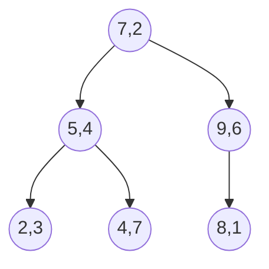

[TOC]


#### kd Tree


例：{（2,3），（5,4），（9,6），（4,7），（8,1），（7,2）}

先按x轴以中间点分割,再按y轴分割




```
#include<bits/stdc++.h>
using namespace std;
const int N=6e4+10,K=5;
const int inf=0x3f3f3f3f;
#define sqr(x) (x)*(x)
int k,n,idx;
struct point{
    int x[K];
    bool operator < (const point &u) const{
     return x[idx]<u.x[idx];
    }
}po[N];
typedef pair<double,point>tp;
priority_queue<tp>nq;
struct kdTree{
    point pt[N<<2];
    int son[N<<2];//子树大小，并记录有无后续节点
   	void build(int l,int r,int rt=1,int dep=0){
        if(l>r)return;
        son[rt]=r-l;son[rt<<1]=son[rt<<1|1]=-1;
        idx=dep%k;//按不同维依次划分
        int mid=(l+r)/2;
        nth_element(po+l,po+mid,po+r+1);
        pt[rt]=po[mid];
        build(l,mid-1,rt<<1,dep+1);
        build(mid+1,r,rt<<1|1,dep+1);
    }
    void query(point p,int m,int rt=1,int dep=0){
        if(son[rt]==-1)return;
        tp nd(0,pt[rt]);
        for(int i=0;i<k;i++)nd.first+=sqr(nd.second.x[i]-p.x[i]);
        int dim=dep%k,x=rt<<1,y=rt<<1|1,fg=0;
        if(p.x[dim]>=pt[rt].x[dim])swap(x,y);
        if(~son[x])query(p,m,x,dep+1);//查找当前维近的点
        if(nq.size()<m)nq.push(nd),fg=1;//点数不到，加入
        else{
            if(nd.first<nq.top().first)nq.pop(),nq.push(nd);//距离较近，加入
            if(sqr(p.x[dim]-pt[rt].x[dim])<nq.top().first)fg=1;//当前维的距离比最近的远则不往另一边搜索了
        }
        if(~son[y]&&fg)query(p,m,y,dep+1);
    }
}kd;
void print(point &p){
    for(int j=0;j<k;j++) printf("%d%c",p.x[j],j==k-1?'\n':' ');
}
int main(){
    while(scanf("%d%d",&n,&k)!=EOF){//点数，维数
        for(int i=0;i<n;i++) for(int j=0;j<k;j++) scanf("%d",&po[i].x[j]);
        kd.build(0,n-1);
        int q;scanf("%d",&q);//询问次数
        while (q--){
            point ask;
            for(int j=0;j<k;j++) scanf("%d",&ask.x[j]);
            int m;scanf("%d",&m);//最近的m个点
            kd.query(ask,m);
            printf("the closest %d points are:\n", m);
            point pt[20];
            for(int j=1;!nq.empty();j++)pt[j]=nq.top().second,nq.pop();
            for(int j=m;j>=1;j--)print(pt[j]);
        }
    }
    return 0;
}
```

bzoj 天使玩具

给定n个(x_i,y_i)

两种操作 1.多加一个(x_i,y_i)

2.查询距离(x_i,y_i)曼哈顿距离最近的点的距离

```
#include<bits/stdc++.h>
using namespace std;

const int INF=0x3f3f3f3f;
const int N=300010;
int root,n,m,x,y,opt,cmpd,ans;
struct node{
    int d[2],mn[2],mx[2],lc,rc;
};
node t[N<<1];

bool cmp(const node &a,const node &b){
    if (a.d[cmpd]!=b.d[cmpd]) return a.d[cmpd]<b.d[cmpd];
    else return a.d[!cmpd]<b.d[!cmpd];
}

void update(int bh){//维护当前结点所控制的区间大小 
    int lc=t[bh].lc;
    int rc=t[bh].rc;
    if (lc){
        t[bh].mn[0]=min(t[bh].mn[0],t[lc].mn[0]);
        t[bh].mn[1]=min(t[bh].mn[1],t[lc].mn[1]);
        t[bh].mx[0]=max(t[bh].mx[0],t[lc].mx[0]);
        t[bh].mx[1]=max(t[bh].mx[1],t[lc].mx[1]);
    }
    if (rc){
        t[bh].mn[0]=min(t[bh].mn[0],t[rc].mn[0]);
        t[bh].mn[1]=min(t[bh].mn[1],t[rc].mn[1]);
        t[bh].mx[0]=max(t[bh].mx[0],t[rc].mx[0]);
        t[bh].mx[1]=max(t[bh].mx[1],t[rc].mx[1]);
    } 
}

int build(int l,int r,int D){
    cmpd=D;
    int mid=(l+r)>>1;
    nth_element(t+l,t+mid+1,t+r+1,cmp);
    t[mid].mn[0]=t[mid].mx[0]=t[mid].d[0];
    t[mid].mn[1]=t[mid].mx[1]=t[mid].d[1];
    if (mid!=l) t[mid].lc=build(l,mid-1,!D);
    if (mid!=r) t[mid].rc=build(mid+1,r,!D);
    update(mid);
    return mid;       //不用忘了返回值 
}

void insert(int p){
    int D,now;
    D=0; now=root;
    while (1){
        if (t[p].mn[0]<t[now].mn[0]) t[now].mn[0]=t[p].mn[0];   //按照插入结点修改维护范围 
        if (t[p].mn[1]<t[now].mn[1]) t[now].mn[1]=t[p].mn[1];
        if (t[p].mx[0]>t[now].mx[0]) t[now].mx[0]=t[p].mx[0];
        if (t[p].mx[1]>t[now].mx[1]) t[now].mx[1]=t[p].mx[1];
        if (t[p].d[D]>=t[now].d[D]){
            if (!t[now].rc){
                t[now].rc=p;
                return;
            }
            else now=t[now].rc;
        }
        else{
            if (!t[now].lc){
                t[now].lc=p;
                return;
            }
            else now=t[now].lc;
        }
        D=!D;
    }
}

int dis(int p,int x,int y){
    int d=0;
    if (x<t[p].mn[0]) d+=(t[p].mn[0]-x);
    if (x>t[p].mx[0]) d+=(x-t[p].mx[0]);
    if (y<t[p].mn[1]) d+=(t[p].mn[1]-y);
    if (y>t[p].mx[1]) d+=(y-t[p].mx[1]);
    return d;
}

void ask(int now){
    int dl,dr,d0;
    d0=abs(t[now].d[0]-x)+abs(t[now].d[1]-y);
    if (d0<ans) ans=d0;

    if (t[now].lc) dl=dis(t[now].lc,x,y);
    else dl=INF;
    if (t[now].rc) dr=dis(t[now].rc,x,y);
    else dr=INF;
    
    if (dl<dr){
        if (dl<ans) ask(t[now].lc);     //距离近的先递归 
        if (dr<ans) ask(t[now].rc);
    }
    else{
        if (dr<ans) ask(t[now].rc);
        if (dl<ans) ask(t[now].lc);
    }
}

signed main(){
    scanf("%d%d",&n,&m);
    for (int i=1;i<=n;i++)
        scanf("%d%d",&t[i].d[0],&t[i].d[1]);
    root=build(1,n,0);
    int opt;
    for (int i=1;i<=m;i++){
        scanf("%d%d%d",&opt,&x,&y);
        if (opt==1){
            n++;
            t[n].d[0]=t[n].mn[0]=t[n].mx[0]=x;
            t[n].d[1]=t[n].mn[1]=t[n].mx[1]=y;
            insert(n);
        }
        else {
            ans=INF;
            ask(root);
            printf("%d\n",ans);
        }
    }
    return 0;
}
```

杭电多校第二场02 kaizyn、侯爷、汤 代码

```
#include <bits/stdc++.h>
#define repeat(i, a, b) for (int i = (a), ib = (b); i < ib; i++)
#define int long long
#define sqr(x) (x)*(x)
using namespace std;
const int N=2e5+10,inf=1e16;
#define debug 0
struct kdt{
    struct range{
        int l,r;
        range operator|(range b)const{
            return {min(l,b.l),max(r,b.r)};
        }
        int mindist(int x){
            return sqr(x<l ? l-x : x>r ? x-r : 0);
        }
        int maxdist(int x){
            return sqr(max(x - l, r - x));
        }
    };
    struct node{
        int x,y; // (x,y): coordinate
        int v,sum,d,sz; // d: cut direction, sz: size of subtree
        range xx,yy; // xx/yy: range of coordinate x/y
        node *l,*r; // left/right child
        int mindist(int x,int y){
            return xx.mindist(x)+yy.mindist(y);
        }
        int maxdist(int x, int y) {
            return xx.maxdist(x)+yy.maxdist(y);
        }
        node *&ch(int px,int py){ // in which child
            if(d==0)return px<x ? l : r;
            else return py<y ? l : r;
        }
        void up(){
            sz=l->sz+r->sz+1;
            sum=v+l->sum+r->sum;
            xx=range{x,x} | l->xx | r->xx;
            yy=range{y,y} | l->yy | r->yy;
        }
        node(){
            sz=0;
            xx=yy={inf,-inf};
            l=r=Null;
        }
        node(int x_,int y_, int v){
            x=x_,y=y_; this->v = v;
            l=r=Null;
            up();
        }
    }*rt;
    static node Null[N],*pl;
    vector<node *> cache;
    void init(){ // while using kdtrees, notice Null is static
        rt=pl=Null;
    }
    node *build(node **l,node **r,int d){ // private
        if(l>=r)return Null;
        node **mid=l+(r-l)/2;
        if(d==0)
            nth_element(l,mid,r,[&](node *a,node *b){
                return a->x < b->x;
            });
        else
            nth_element(l,mid,r,[&](node *a,node *b){
                return a->y < b->y;
            });
        node *u=*mid;
        u->d=d;
        u->l=build(l,mid,d^1);
        u->r=build(mid+1,r,d^1);
        u->up();
        return u;
    }
    void pia(node *u){ // private
        if(u==Null)return;
        pia(u->l);
        cache.push_back(u);
        pia(u->r);
    }
    void insert(node *&u,int x,int y,int v){ // private
        if(u==Null){
            *++pl=node(x,y,v); u=pl; u->d=0;
            return;
        }
        insert(u->ch(x,y),x,y,v);
        u->up();
        if(0.725*u->sz <= max(u->l->sz,u->r->sz)){
            cache.clear();
            pia(u);
            u=build(cache.data(),cache.data()+cache.size(),u->d);
        }
    }
    void insert(int x,int y,int v){
        insert(rt,x,y,v);
    }
    int ans;
    void calc(node *u,int x,int y,int r){ // private
        if(u==Null)return;
        if (debug) printf("[%lld %lld %lld %lld] %lld, %lld\n", u->xx.l, u->xx.r, u->yy.l, u->yy.r, u->v, u->sum);
        if (u->mindist(x,y)>r) return;
        if (u->maxdist(x,y)<=r) {
            ans+=u->sum;
            return;
        }
        if (sqr(x-u->x)+sqr(y-u->y)<=r)ans+=u->v;
        calc(u->l,x,y,r);
        calc(u->r,x,y,r);
    }
    int calc(int x,int y,int r){
        ans=0;
        calc(rt,x,y,r);
        return ans;
    }
}tr;
kdt::node kdt::Null[N],*kdt::pl;
void Solve() {
    int n;
    cin>>n;
    tr.init();
    repeat (i, 0, n) {
        int x,y,v,r;
        scanf("%d%d%d%d",&x,&y,&v,&r);//(x,y),权值为v，半径为r,查询圆内点权和
        tr.insert(x,y,v);
        printf("%d\n",tr.calc(x,y,r*r));
    }
}
signed main() {
    int T = 1;cin>>T;
    while(T--){
        Solve();
    }
    return 0;
}
```

#### 线段树

1.q个询问，对区间升序或降序排列，查询x位置最终值

$O(nlog^2n)$做法：对分，每次将>=mid的设为1，<mid的设为0，排序按照01排序，如果最后x位置为1，代表最终值>=mid

$O(nlogn)$做法：线段树分裂，

2.区间加减和区间0的个数，维护最小值和最小值的个数就好了

##### 正常线段树

```
struct SegmentTree{
	#define lc (rt<<1)
	#define rc (rt<<1|1)
	#define mid (l+r>>1)
    struct node{
        int sum,lz;
        int l,r;
    }tr[N<<2];
    void ad(int rt,int add){//区间加
        tr[rt].lz+=add;
        tr[rt].sum+=(tr[rt].r-tr[rt].l+1)*add;
        /*
        //区间覆盖
        tr[rt].lz=add;
        tr[rt].sum=add;
        */
    }
    void pushup(int rt){
        tr[rt].sum=tr[lc].sum+tr[rc].sum;
    }
    void putdown(int rt){
        if (tr[rt].lz){
            ad(lc,tr[rt].lz);ad(rc,tr[rt].lz);
            tr[rt].lz=0;
        }
    }
    void build(int l,int r,int rt=1){
        tr[rt].l=l;tr[rt].r=r;tr[rt].lz=0;
        if (l==r){
            tr[rt].sum=0;return;
        }
        build(l,mid,lc);build(mid+1,r,rc);
        pushup(rt);
    }
    void update(int l,int r,int add,int rt=1){
        if (tr[rt].l>=l&&tr[rt].r<=r){
            ad(rt,add);
            return;
        }
        putdown(rt);
        if (tr[lc].r>=l)update(l,r,add,lc);
        if (tr[rc].l<=r)update(l,r,add,rc);
        pushup(rt);
    }
    int query(int l,int r,int rt=1){
        if (tr[rt].l==l&&tr[rt].r==r){
            return tr[rt].sum;
        }
        putdown(rt);
        if (tr[lc].r>=r)return query(l,r,lc);
        if (tr[rc].l<=l)return query(l,r,rc);
        return query(l,tr[lc].r,lc)+query(tr[rc].l,r,rc);
    }
}tr;
```

##### 变化

把[l,r]的数设为add，个数清为0；把[l,r]的数的个数+add个；询问区间数*其个数和

```
struct SegmentTree1{
	#define lc (rt<<1)
	#define rc (rt<<1|1)
	#define mid (l+r>>1)
    struct node{
        int sa,lza,lzb,sum;
        int l,r;
    }tr[N<<2];
    void ad(int rt,int add){
        tr[rt].sum+=tr[rt].sa*add;
        tr[rt].lzb+=add;
	}
    void color(int rt,int add){
		tr[rt].sa=(tr[rt].r-tr[rt].l+1)*add;
        tr[rt].sum=tr[rt].lzb=0;
		tr[rt].lza=add;
	}
    void pushup(int rt){
        tr[rt].sum=tr[lc].sum+tr[rc].sum;
        tr[rt].sa=tr[lc].sa+tr[rc].sa;
    }
    void putdown(int rt){
        if (tr[rt].lza){
			color(lc,tr[rt].lza);color(rc,tr[rt].lza);
			tr[rt].lza=0;
		}
		if (tr[rt].lzb){
			ad(lc,tr[rt].lzb);ad(rc,tr[rt].lzb);
			tr[rt].lzb=0;
		}
    }
    void build(int l,int r,int rt=1){
        tr[rt].l=l;tr[rt].r=r;tr[rt].lza=tr[rt].lzb=0;
        if (l==r){
            tr[rt].sum=tr[rt].sa=0;return;
        }
        build(l,mid,lc);build(mid+1,r,rc);
        pushup(rt);
    }
    void update1(int l,int r,int add,int rt=1){//把[l,r]的数设为add，个数清为0
        if (tr[rt].l>=l&&tr[rt].r<=r){
            color(rt,add);
            return;
        }
        putdown(rt);
        if (tr[lc].r>=l)update1(l,r,add,lc);
        if (tr[rc].l<=r)update1(l,r,add,rc);
        pushup(rt);
    }
    void update2(int l,int r,int add,int rt=1){//把[l,r]的数的个数+add个
        if (tr[rt].l>=l&&tr[rt].r<=r){
            ad(rt,add);
            return;
        }
        putdown(rt);
        if (tr[lc].r>=l)update2(l,r,add,lc);
        if (tr[rc].l<=r)update2(l,r,add,rc);
        pushup(rt);
    }
    int query(int l,int r,int rt=1){//[l,r]的数*其个数的和
        if (tr[rt].l==l&&tr[rt].r==r){
            return tr[rt].sum;
        }
        putdown(rt);
        if (tr[lc].r>=r)return query(l,r,lc);
        if (tr[rc].l<=l)return query(l,r,rc);
        return query(l,tr[lc].r,lc)+query(tr[rc].l,r,rc);
    }
}tr2;
```

##### 扫描线

求矩形面积交

对y排序，将y之前的全部x区间都放入线段树

```
#include<bits/stdc++.h>
using namespace std;
#define int long long
const int N=4e5+10;
int n;
int b[N];
int cnt1=0,cnt2=0;
int x_1[N],x_2[N],y_1[N],y_2[N];
struct node{
    int l,r,h,op;
}a[N];
bool cmp(node a,node b){
    return a.h<b.h;
}
struct Tree{
    struct Tr{
        int l,r,val,len;
    }tr[N<<2];
    void pushup(int rt) {
        if(tr[rt].val)tr[rt].len=b[tr[rt].r+1]-b[tr[rt].l];
        else tr[rt].len=tr[rt<<1].len+tr[rt<<1|1].len;
    }
    void build(int l,int r,int rt){
        tr[rt].l=l;tr[rt].r=r;tr[rt].val=0;
        if (l==r){
            tr[rt].val=0;tr[rt].len=0;
            return;
        }
        int mid=l+r>>1;
        build(l,mid,rt<<1);build(mid+1,r,rt<<1|1);
        pushup(rt);
    }
    void update(int l,int r,int val,int rt){
        if (tr[rt].l>=l&&tr[rt].r<=r){
            tr[rt].val+=val;
            pushup(rt);
            return;
        }
        if (l<=tr[rt<<1].r)update(l,r,val,rt<<1);
        if (r>=tr[rt<<1|1].l)update(l,r,val,rt<<1|1);
        pushup(rt);
    }
}tr;
map<int,int>id;
signed main(){
    cin>>n;
    for (int i=1;i<=n;i++){
        scanf("%lld%lld%lld%lld",&x_1[i],&y_1[i],&x_2[i],&y_2[i]);
        b[++cnt1]=x_1[i];b[++cnt1]=x_2[i];
        a[++cnt2].l=x_1[i];a[cnt2].r=x_2[i];a[cnt2].h=y_1[i];a[cnt2].op=1;
        a[++cnt2].l=x_1[i];a[cnt2].r=x_2[i];a[cnt2].h=y_2[i];a[cnt2].op=-1;
    }
    sort(a+1,a+1+cnt2,cmp);
    sort(b+1,b+1+cnt1);
    int t=unique(b+1,b+1+cnt1)-b-1;
    for (int i=1;i<=t;i++)id[b[i]]=i;
    tr.build(1,t-1,1);
    int ans=0;
    for (int i=1;i<cnt2;i++){
        tr.update(id[a[i].l],id[a[i].r]-1,a[i].op,1);
        ans+=(a[i+1].h-a[i].h)*tr.tr[1].len;
    }
    cout<<ans<<endl;
    return 0;
}
```

##### 动态开点线段树

如果要打lazy标记，则要建立出左右儿子再pushdown

```
#include<bits/stdc++.h>
using namespace std;
const int N=5e5+7;
int n;
struct SegmentTree{
    int cnt;
    struct node{
        int l,r,val;
    }tr[N*20];//nlogn n为权值个数
    void init(){
        cnt=0;
    }
    int newnode(){
        ++cnt;
        tr[cnt].l=tr[cnt].r=tr[cnt].val=0;
        return cnt;
    }
    int query(int rt,int L,int R,int l,int r){
        if(!rt)return 0;
        if(L==l&&R==r)return tr[rt].val;
        int mid=L+R>>1;
        if(r<=mid)return query(tr[rt].l,L,mid,l,r);
        if(l>mid)return query(tr[rt].r,mid+1,R,l,r);
        return query(tr[rt].l,L,mid,l,mid)+query(tr[rt].r,mid+1,R,mid+1,r); 
    }
    void pushup(int rt){
        tr[rt].val=tr[tr[rt].l].val+tr[tr[rt].r].val;
    }
    void update(int &rt,int L,int R,int x,int add){
        if(!rt)rt=newnode();
        if(L==R){
            tr[rt].val+=add;return;
        }
        int mid=L+R>>1;
        if(x<=mid)update(tr[rt].l,L,mid,x,add);
        else update(tr[rt].r,mid+1,R,x,add);
        pushup(rt);
    }
}tr;
signed main(){
    int n,rt=0;
    tr.init();
    scanf("%d",&n);
    long long ans=0;
    for(int i=1;i<=n;i++){
        int x;
        scanf("%d",&x);
        ans+=tr.query(rt,1,1e9,x+1,1e9);
        tr.update(rt,1,1e9,x,1);
    }
    printf("%lld",ans);
    return 0;
}
```

##### 李超线段树

[P4097 [HEOI2013\]Segment - 洛谷 | 计算机科学教育新生态 (luogu.com.cn)](https://www.luogu.com.cn/problem/solution/P4097)

求函数定点最值的线段树

强制在线q个操作

1.加入一条线段 $(x_1,y_1),(x_2,y_2)$，第i条插入的编号为i

2.给定k，询问x=k相交的线段树中，交点纵坐标最大的线段的编号，存在多条最大纵坐标则选取最小的编号

$q\leq1e5,k,x_0,x_1\leq39989,y_0,y_1\leq1e9$

李超线段树的结构和普通线段树一样的，只是它每个节点存的是该区间**优势最大**的线段（**优势最大即暴露在最高折线中横坐标跨度最大**）。


```
#include <bits/stdc++.h>
using namespace std;
const int inf=0x3f3f3f3f;
const int N=1e5,M=39989;
int q,lcnt;
typedef pair<double,double> line;
double f(line x,int X){
    return x.first*X+x.second;
}
double inter(line x,line y){//交点横坐标
    return (y.second-x.second)/(x.first-y.first);
}
line li[N+7];//记录y=kx+b的k和b
//Licaotree
int v[(N<<2)+7];//记录区间优势最大线段
bitset<(N<<2)+7>ma;
void add(int x,int L,int R,int k=1,int l=1,int r=M){
    int mid=(l+r)>>1;
    if(L<=l&&r<=R){//分类讨论是否更换区间优势最大线段
        if(!ma[k]){v[k]=x,ma[k]=1;return;}
        double ly1=f(li[x],l),ry1=f(li[x],r),ly=f(li[v[k]],l),ry=f(li[v[k]],r);
        if(ly1<=ly&&ry1<=ry)return;
        if(ly1>=ly&&ry1>=ry){v[k]=x;return;}
        double in=inter(li[v[k]],li[x]);
        if(ly1>=ly){
            if(in<=mid)add(x,L,R,k<<1,l,mid);
            else add(v[k],L,R,k<<1|1,mid+1,r),v[k]=x;
        }
        else{
            if(in>mid)add(x,L,R,k<<1|1,mid+1,r);
            else add(v[k],L,R,k<<1,l,mid),v[k]=x;
        }
        return;
    }
    if(mid>=L)add(x,L,R,k<<1,l,mid);
    if(mid<R)add(x,L,R,k<<1|1,mid+1,r);
}
int lccmp(int X,int x,int y){//返回X位置y大的线段标号
    return f(li[x],X)>f(li[y],X)?x:y;
}
int get(int X,int k=1,int l=1,int r=M){
    int res=0;
    if(ma[k])res=lccmp(X,res,v[k]);
    if(l==r)return res;
    int mid=(l+r)>>1;
    if(mid>=X)res=lccmp(X,res,get(X,k<<1,l,mid));
    else res=lccmp(X,res,get(X,k<<1|1,mid+1,r));
    return res;
}
//Main
int ans;
void h(int&x,int mod){//强制在线
    x=(x+ans-1)%mod+1;
}
signed main(){
    int op;
    lcnt=0;
    scanf("%d",&q);
    for(int i=1;i<=q;i++){
        scanf("%d",&op);
        if(op){
            int xa,ya,xb,yb;
            scanf("%d%d%d%d",&xa,&ya,&xb,&yb);h(xa,M),h(ya,1e9),h(xb,M),h(yb,1e9);
            if (xa==xb)li[++lcnt]=make_pair(0.0,double(max(ya,yb)));//垂线
            else li[++lcnt]=make_pair(double(yb-ya)/(xb-xa),-double(yb-ya)/(xb-xa)*xa+ya);
            add(lcnt,min(xa,xb),max(xa,xb));
        }
        else{
            int k;
            scanf("%d",&k);h(k,M);
            printf("%d\n",ans=get(k));
        }
    }
    return 0;
}
```

##### 线段树合并

动态开点线段树，同字典树合并

1.给出一棵$n$个节点以$1$为根的树，节点$u$的颜色为$c_u$，现在对于每个结点$u$询问子树里颜色最多的c的和,$n\leq 1e5，c\leq 1e9$。

```
#include<bits/stdc++.h>
using namespace std;
#define int long long
const int N=1e5+10;
int n,m;
struct Seg{
    int cnt=0;
    struct tree{
        int l,r,val,ans;
    }tr[N*31];//nlogm m为权值个数
    void init(){
        cnt=0;
    }
    int newnode(){
        int rt=++cnt;tr[rt].l=tr[rt].r=tr[rt].val=0;
        return rt;
    }
    void pushup(int rt){
        if(tr[tr[rt].l].val==tr[tr[rt].r].val){
            tr[rt].val=tr[tr[rt].l].val;
            tr[rt].ans=tr[tr[rt].l].ans+tr[tr[rt].r].ans;
        }
        if(tr[tr[rt].l].val<tr[tr[rt].r].val){
            tr[rt].val=tr[tr[rt].r].val;
            tr[rt].ans=tr[tr[rt].r].ans;
        }
        if(tr[tr[rt].l].val>tr[tr[rt].r].val){
            tr[rt].val=tr[tr[rt].l].val;
            tr[rt].ans=tr[tr[rt].l].ans;
        }
    }
    void update(int &rt,int l,int r,int x,int add){
        if (!rt)rt=newnode();
        if (l==r){
            tr[rt].val+=add;tr[rt].ans=l;
            return;
        }
        int mid=l+r>>1;
        if (x<=mid)update(tr[rt].l,l,mid,x,add);
        else update(tr[rt].r,mid+1,r,x,add);
        pushup(rt);
    }
    int merge(int u,int v,int l,int r){
        if(!u)return v;
        if(!v)return u;
        if (l==r){
            tr[u].val+=tr[v].val;tr[u].ans=l;
            return u;
        }
        int mid=l+r>>1;
        tr[u].l=merge(tr[u].l,tr[v].l,l,mid);
        tr[u].r=merge(tr[u].r,tr[v].r,mid+1,r);
        pushup(u);
        return u;
    }
}tr;
int rt[N];
vector<int>v[N];
int ans[N],c[N];
void dfs(int x,int fa){
    for (int i:v[x]){
        if (i==fa)continue;
        dfs(i,x);
        tr.merge(rt[x],rt[i],1,m);
    }
    tr.update(rt[x],1,m,c[x],1);
    ans[x]=tr.tr[rt[x]].ans;
}
signed main(){
    int x,y;
    cin>>n;
    m=1e9+10;
    for (int i=1;i<=n;i++)scanf("%lld",&c[i]),rt[i]=tr.newnode();
    for (int i=1;i<n;i++){
        scanf("%lld%lld",&x,&y);
        v[x].push_back(y);v[y].push_back(x);
    }
    dfs(1,0);
    for (int i=1;i<=n;i++)printf("%lld ",ans[i]);
    return 0;
}
```

2.树上有n个点，有m个操作，每次操作会将x->y的最短路径上的点运一袋z类型粮食，问每个点在m次操作后哪种类型的粮食最多，一样多的输出类型号最小的数（洛谷P4556 [Vani有约会]雨天的尾巴）

考虑动态开点线段树和差分，x处z权值++，y处z权值++，lca(x,y)处z权值--，fa[lca(x,y)]处z权值--

```
#include <bits/stdc++.h>
using namespace std;
const int N=1e5+10;
int n,m;
vector<int>v[N];
vector<pair<int,int>>e[N];
int rt[N];
struct SegmentTree{
    int cnt=0;
    struct node{
        int l,r,val,p;
    }tr[N*20];//nlogn n为权值个数
    void init(){
        cnt=0;
    }
    int newnode(){
        ++cnt;
        tr[cnt].l=tr[cnt].r=tr[cnt].val=tr[cnt].p=0;
        return cnt;
    }
    void pushup(int rt){
        if (tr[tr[rt].l].val<tr[tr[rt].r].val){
            tr[rt].val=tr[tr[rt].r].val;tr[rt].p=tr[tr[rt].r].p;
        }
        else{
            tr[rt].val=tr[tr[rt].l].val;tr[rt].p=tr[tr[rt].l].p;
        }
        if (tr[rt].val==0)tr[rt].p=0;
    }
    int query(int rt,int L,int R,int l,int r){
        if(!rt)return 0;
        if(L==l&&R==r)return tr[rt].val;
        int mid=L+R>>1;
        if(r<=mid)return query(tr[rt].l,L,mid,l,r);
        if(l>mid)return query(tr[rt].r,mid+1,R,l,r);
        return query(tr[rt].l,L,mid,l,mid)+query(tr[rt].r,mid+1,R,mid+1,r); 
    }
    void update(int &rt,int L,int R,int x,int add){
        if(!rt)rt=newnode();
        if(L==R){
            tr[rt].val+=add;tr[rt].p=L;if (tr[rt].val==0)tr[rt].p=0;return;
        }
        int mid=L+R>>1;
        if(x<=mid)update(tr[rt].l,L,mid,x,add);
        else update(tr[rt].r,mid+1,R,x,add);
        pushup(rt);
    }
    void merge(int &p1,int &p2,int l,int r){//合并
        if(!p1)p1=newnode();
        if(!p2)p2=newnode();
        if(l==r){
            tr[p1].val+=tr[p2].val;
            tr[p1].p=l;if (tr[p1].val==0)tr[p1].p=0;
            return;
        }
        int mid=l+r>>1;//分情况讨论下
        if(tr[p1].l&&tr[p2].l)merge(tr[p1].l,tr[p2].l,l,mid);
        else if(tr[p2].l)tr[p1].l=tr[p2].l;
        if(tr[p1].r&&tr[p2].r)merge(tr[p1].r,tr[p2].r,mid+1,r);
        else if(tr[p2].r)tr[p1].r=tr[p2].r;
        pushup(p1);
    }
}tr;
int dep[N],f[N][21];
void dfs(int u,int fa){
    dep[u]=dep[fa]+1;
    for(int i=0;i<=19;i++)f[u][i+1]=f[f[u][i]][i];
    for(int i:v[u]){
        int v=i;
        if(v==fa) continue;
        f[v][0]=u;
        dfs(v,u);
    }
}
int LCA(int x,int y){
    if(dep[x]<dep[y]) swap(x,y);//让x深度较大
    //用“暴力”的思想：先让x,y跳到同一深度，然后一起往上跳 
    for(int i=20;i>=0;i--){//倒着for，x能多跳尽量多跳 ，才能优化时间 
        if(dep[f[x][i]]>=dep[y]) x=f[x][i];//先跳到同一层
        if(x==y) return y;
    }
    for(int i=20;i>=0;i--){//此时x,y已跳到同一层 
        if(f[x][i]!=f[y][i]){//如果 f[x][i]和f[y][i]不同才跳 
            x=f[x][i];
            y=f[y][i];
        }
    }
    return f[x][0];//跳完上述步骤后，两点离LCA仅一步之遥，让x(或y)再向上跳一步就是LCA。
}
int ans[N];
void dfs1(int x,int fa){
    for (int i:v[x]){
        if (i==fa)continue;
        dfs1(i,x);
        tr.merge(rt[x],rt[i],0,1e5);
    }
    for(auto i:e[x])tr.update(rt[x],0,1e5,i.first,i.second);
    ans[x]=tr.tr[rt[x]].p;
}
signed main(){
    int x,y,z;
    cin>>n>>m;
    for (int i=1;i<n;i++){
        scanf("%d%d",&x,&y);
        v[x].push_back(y);v[y].push_back(x);
    }
    dfs(1,0);
    for (int i=1;i<=m;i++){
        scanf("%d%d%d",&x,&y,&z);
        e[x].push_back({z,1});e[y].push_back({z,1});
        int t=LCA(x,y);
        e[t].push_back({z,-1});e[f[t][0]].push_back({z,-1});
    }
    tr.init();
    dfs1(1,0);
    for (int i=1;i<=n;i++)printf("%d\n",ans[i]);
    return 0;
}
```

##### 线段树分裂


#### 主席树

静态数组第k大

```
//每棵树维护1-数的最大值，T维护数的下标
#include<bits/stdc++.h>
using namespace std;
const int N=200010;
int n,q,m;
int a[N],b[N],T[N];
struct Chairman{
    int cnt=0;
    int sum[N<<5],L[N<<5],R[N<<5];
    void init(){
        cnt=0;
    }
    void pushup(int rt){
        sum[rt]=sum[L[rt]]+sum[R[rt]];
    }
    int build(int l,int r){
        int rt=++cnt;
        if (l==r){
            sum[rt]=0;return rt;
        }
        int mid=(l+r)>>1;
        L[rt]=build(l,mid);R[rt]=build(mid+1,r);
        pushup(rt);
        return rt;
    }
    int update(int pre,int l,int r,int x){
        int rt=++cnt;
        L[rt]=L[pre];R[rt]=R[pre];
        if (l==r){
            sum[rt]=sum[pre]+1;
            return rt;
        }
        int mid=(l+r)>>1;
        if (x<=mid)L[rt]=update(L[pre],l,mid,x);
        else R[rt]=update(R[pre],mid+1,r,x);
        pushup(rt);
        return rt;
    }
    int query(int ll,int rr,int l,int r,int k){
        if (l>=r)return l;
        int x=sum[L[rr]]-sum[L[ll]];
        int mid=(l+r)>>1;
        if (x>=k)return query(L[ll],L[rr],l,mid,k);
        else return query(R[ll],R[rr],mid+1,r,k-x);
    }
}hjt;
signed main(){
    scanf("%d%d",&n,&q);
    for (int i=1;i<=n;i++){
        scanf("%d",&a[i]);
        b[i]=a[i];
    }
    sort(b+1,b+1+n);
    m=unique(b+1,b+1+n)-b-1;
    hjt.init();
    T[0]=hjt.build(1,m);
    for (int i=1;i<=n;i++){
        int t=lower_bound(b+1,b+1+m,a[i])-b;
        T[i]=hjt.update(T[i-1],1,m,t);
    }
    while (q--){
        int x,y,z;
        scanf("%d%d%d",&x,&y,&z);
        int t=hjt.query(T[x-1],T[y],1,m,z);
        printf("%d\n",b[t]);
    }
    return 0;
}
```

动态开点

```
#include<bits/stdc++.h>
using namespace std;
const int N=200010;
int n,q,m;
int a[N],T[N];
struct Chairman{
    int cnt=0;
    struct node{
        int sum,l,r;
    }tr[N*32];
    void init(){
        cnt=0;
    }
    int newnode(){
        int rt=++cnt;
        tr[rt].l=tr[rt].r=tr[rt].sum=0;
        return rt;
    }
    void pushup(int rt){
        tr[rt].sum=tr[tr[rt].l].sum+tr[tr[rt].r].sum;
    }
    void update(int &rt,int pre,int l,int r,int x){
        rt=newnode();
        tr[rt].l=tr[pre].l;tr[rt].r=tr[pre].r;
        if (l==r){
            tr[rt].sum=tr[pre].sum+1;
            return;
        }
        int mid=(l+r)>>1;
        if (x<=mid)update(tr[rt].l,tr[pre].l,l,mid,x);
        else update(tr[rt].r,tr[pre].r,mid+1,r,x);
        pushup(rt);
    }
    int query(int ll,int rr,int l,int r,int k){
        if (l>=r)return l;
        int x=tr[tr[rr].l].sum-tr[tr[ll].l].sum;
        int mid=(l+r)>>1;
        if (x>=k)return query(tr[ll].l,tr[rr].l,l,mid,k);
        else return query(tr[ll].r,tr[rr].r,mid+1,r,k-x);
    }
}hjt;
signed main(){
    scanf("%d%d",&n,&q);
    for (int i=1;i<=n;i++)scanf("%d",&a[i]);
    hjt.init();
    m=1e9;
    for (int i=1;i<=n;i++)hjt.update(T[i],T[i-1],-m,m,a[i]);
    while (q--){
        int x,y,z;
        scanf("%d%d%d",&x,&y,&z);
        int t=hjt.query(T[x-1],T[y],-m,m,z);
        printf("%d\n",t);
    }
    return 0;
}
```

#### 树状数组

```
int c[N];
void add(int x,int k){
    for (int i=x;i<=n;i+=i&-i)c[i]+=k;
}
int que(int x){
    int res=0;
    for (int i=x;i;i-=i&-i)res+=c[i];
    return res;
}
```

二维可以处理区间问题，例如 add(n+1-l,r,k)，que(n+1-l,r)

查询子树[l,r]区间可以考虑，在dfs x时，可以先记录[l,r]区间的查询，再在dfs子树后，再次查询[l,r]区间，两者相减为答案

#### 链表

记录连续最长链表长度，如1,2,...,n

```
struct List{
	static const int N=1e5+7;
	int max_len;
	int lp[N],rp[N],vis[N];
	vector<pair<int&,int>>stk;//用来存每个操作
	void init(int n){//全部初始化
		stk.clear();
		max_len=0;
		for (int i=0;i<=n;++i)lp[i]=rp[i]=i,vis[i]=0;
	}
	void insert(int x,int mem) {
		if (mem)stk.emplace_back(vis[x],vis[x]);
		if (++vis[x]>1)return;
		int llp=lp[x-1],rrp=rp[x];
		if (mem){
            stk.emplace_back(rp[llp],rp[llp]);
            stk.emplace_back(lp[rrp],lp[rrp]);
		}
		rp[llp]=rrp;
		lp[rrp]=llp;
		if (rrp-llp>max_len){
			if (mem)stk.emplace_back(max_len,max_len);
            max_len=rrp-llp;
		}
	}
	void pop_all(){//只会pop mem=1的元素
		while (stk.size()){
            stk.back().first=stk.back().second;
            stk.pop_back();
		}
	}
}list1,list2;
```


#### 笛卡尔树

笛卡尔树是一种二叉树，每一个结点由一个键值二元组$(w,k)$构成。要求$k$满足二叉搜索树的性质，而$w$满足堆的性质。一个有趣的事实是，如果笛卡尔树的$k,w$键值确定，且$k$互不相同，$w$互不相同，那么这个笛卡尔树的结构是唯一的。


上图下标为k，值为w

```
//h为值数组，stk为栈，ls、rs为左右节点下标
top=0;
for (int i=1;i<=n;i++) {
    int k=top;
    while(k>0&&h[stk[k]]>h[i])k--;
    if(k)rs[stk[k]]=i;// rs代表笛卡尔树每个节点的右儿子
    if(k<top)ls[i]=stk[k + 1];// ls代表笛卡尔树每个节点的左儿子
    stk[++k]=i;
    top=k;
}
```

#### 左偏树

```
//多个优先队列合并
#include<bits/stdc++.h>
using namespace std;
const int N=1e5+10;
int n,m;
struct leftist_tree{
    int dis,val,lch,rch,f;
}lt[N];
inline int find(int x){
    if(lt[x].f==x)return x;
    return lt[x].f=find(lt[x].f);
}
inline int merge(int x,int y){//输入两个最大堆的根，返回合并后的根
    if(!x||!y)return x+y;
    if(lt[x].val<lt[y].val)swap(x,y);//<,>号修改可以改变最小堆还是最大堆，也可以重定义函数
    if(x>y&&lt[x].val==lt[y].val)swap(x,y);//下标小的为x，可不要
    int ls=lt[x].lch,rs=lt[x].rch;
    rs=merge(rs,y);
    lt[rs].f=x;
    if(lt[ls].dis<lt[rs].dis)swap(ls,rs);//不左偏了swap回来
    lt[x].lch=ls,lt[x].rch=rs;
    if(lt[x].rch==0)lt[x].dis=0;
    else lt[x].dis=lt[rs].dis+1;
    return x;
}
int pop(int x){//返回删除该点后的根
    int xx=find(x);
    int ls=lt[xx].lch,rs=lt[xx].rch;
    lt[ls].f=ls,lt[rs].f=rs;
    lt[xx].lch=lt[xx].rch=lt[xx].dis=0;
    return merge(ls,rs);
}
int main(){
    int x,y;
    while (scanf("%d",&n)==1){
        for(int i=1;i<=n;i++){
            scanf("%d",&lt[i].val);
            lt[i].f=i;
            lt[i].lch=lt[i].rch=lt[i].dis=0;
        }
        scanf("%d",&m);
        while (m--){
            scanf("%d%d",&x,&y);
            int xx=find(x),yy=find(y);
            if (xx==yy)puts("-1");
            else{
                lt[xx].val>>=1;lt[yy].val>>=1;
                int l=pop(xx),r=pop(yy);
                l=merge(l,xx),r=merge(r,yy);
                printf("%d\n",lt[merge(l,r)].val);
            }
        }
    }
    return 0;
}
```

#### 平衡树

##### Treap

```
//1.插入x
//2.删除一个x
//3.查询x的排名
//4.查询排名为x的数
//5.求小于x，最大的数
//6.求大于x，最小的数
#include<bits/stdc++.h>
using namespace std;
const int N=1e5+10;
const int inf=1e9;
int ch[N][2];//[i][0]代表i左儿子，[i][1]代表i右儿子
int val[N],dat[N];
int size[N],cnt[N];
int tot,root;
void clear(){
    for (int i=0;i<=tot;i++)ch[i][0]=ch[i][1]=0;
    fill(size,size+tot+1,0);
    root=tot=0;
}
int New(int x){
    val[++tot]=x;size[tot]=1;
    dat[tot]=rand();//随机优先级
    cnt[tot]=1;//副本数为1
    return tot;
}
void pushup(int id){
    size[id]=size[ch[id][0]]+size[ch[id][1]]+cnt[id];
}
void build(){
    root=New(-inf),ch[root][1]=New(inf);//先加入正无穷和负无穷，便于之后操作(貌似不加也行)
    pushup(root);
}
void Rotate(int &id,int d){//id是引用传递，0为左旋，1为右旋
    int temp=ch[id][d^1];
    ch[id][d^1]=ch[temp][d];
    ch[temp][d]=id;
    id=temp;
    pushup(ch[id][d]),pushup(id);
}
void insert(int &id,int x){//id依然是引用，在新建节点时可以体现
    if(!id){
        id=New(x);return;//若节点为空，则新建一个节点
    }
    if(x==val[id])cnt[id]++;//若节点已存在，则副本数++;
    else{//要满足BST性质，小于插到左边，大于插到右边
        int d=x<val[id]?0:1;//这个d是方向的意思，按照BST的性质，小于本节点则向左，大于向右
        insert(ch[id][d],x);//递归实现
        if(dat[id]<dat[ch[id][d]])Rotate(id,d^1);//(参考一下图)与左节点交换右旋，与右节点交换左旋
    }
    pushup(id);
}
void Remove(int &id,int x){
    if(!id)return;//到这了发现查不到这个节点，该点不存在，直接返回
    if(x==val[id]){
        if(cnt[id]>1){cnt[id]--,pushup(id);return;}
        if(ch[id][0]||ch[id][1]){//发现只有一个值，且有儿子节点,我们只能把值旋转到底部删除
            if(!ch[id][1]||dat[ch[id][0]]>dat[ch[id][1]]){//当前点被移走之后，会有一个新的点补上来(左儿子或右儿子)，按照优先级，优先级大的补上来
                Rotate(id,1),Remove(ch[id][1],x);//我们会发现，右旋是与左儿子交换，当前点变成右节点；左旋则是与右儿子交换，当前点变为左节点
            }
            else Rotate(id,0),Remove(ch[id][0],x);
            pushup(id);
        }
        else id=0;//发现本节点是叶子节点，直接删除
        return;//这个return对应的是检索到值de所有情况
    }
    if (x<val[id])Remove(ch[id][0],x);
    else Remove(ch[id][1],x);
    pushup(id);
}
int get_rk(int id,int x){
    if(!id)return 0;//若查询值不存在，返回
    if(x==val[id])return size[ch[id][0]] + 1;//查询到该值，由BST性质可知：该点左边值都比该点的值(查询值)小，故rank为左儿子大小 + 1
    else if(x<val[id])return get_rk(ch[id][0],x);//发现需查询的点在该点左边，往左边递归查询
    else return size[ch[id][0]]+cnt[id]+get_rk(ch[id][1],x);//若查询值大于该点值。说明询问点在当前点的右侧，且此点的值都小于查询值，所以要加上cnt[id]
}
int get_ark(int id,int rk){
    if(!id)return inf;
    if(rk<=size[ch[id][0]])return get_ark(ch[id][0],rk);//左边排名已经大于rank了，说明rank对应的值在左儿子那里
    else if(rk<=size[ch[id][0]]+cnt[id])return val[id];//上一步排除了在左区间的情况，若是rank在左与中(目前节点)中，则直接返回目前节点(中区间)的值
    else return get_ark(ch[id][1],rk-size[ch[id][0]]-cnt[id]);//剩下只能在右区间找了，rank减去左区间大小和中区间，继续递归
}
int get_pre(int x){
    int id=root,pre;
    while(id){
        if(val[id]<x)pre=val[id],id=ch[id][1];
        else id=ch[id][0];
    }
    return pre;
}
int get_suf(int x){
    int id=root,next;
    while(id){
        if(val[id]>x)next=val[id],id=ch[id][0];//同理，满足条件向左寻找更小解(也就是最优解)
        else id=ch[id][1];//与上方同理
    }
    return next;
}
int main(){
    build();
    int m,cmd,x;scanf("%d",&m);
    while(m--){
        scanf("%d%d",&cmd,&x);
        if(cmd==1)insert(root,x);
        else if(cmd==2)Remove(root,x);
        else if(cmd==3)printf("%d\n",get_rk(root,x)-1);//注意：因为初始化时插入了INF和-INF,所以查询排名时要减1(-INF不是第一小，是“第零小”)
        else if(cmd==4)printf("%d\n",get_ark(root,x+1));//同理，用排名查询值得时候要查x+1名，因为第一名(其实不是)是-INF
        else if(cmd==5)printf("%d\n",get_pre(x));
        else if(cmd==6)printf("%d\n",get_suf(x));
    }
    return 0;
}
```

##### Splay

```
//准确说不是平衡树，而是伸展树
//hdoj1890
#include <bits/stdc++.h>
using namespace std;
const int N=1e5+10;
int n,pos[N];
struct node{
    int x,id;
}a[N];
struct Splay_Tree{
    int fa[N],ch[N][2],sz[N];
    int flip[N],rt;
    void Flip(int x){
        swap(ch[x][0],ch[x][1]);//要放这里，放下面会出问题
        flip[x]^=1;
    }
    void pushdown(int x){
        if(flip[x]){
            Flip(ch[x][0]);Flip(ch[x][1]);flip[x]=0;
        }
    }
    int pd[N];
    void P(int x){
        int cnt=0;
        while(x){
            pd[++cnt]=x;
            x=fa[x];
        }
        while(cnt)pushdown(pd[cnt--]);
    }
    void pushup(int x){
        sz[x]=sz[ch[x][0]]+sz[ch[x][1]]+1;
    }
    void Rotate(int x){
        int y=fa[x],g=fa[y],c=ch[y][1]==x;
        ch[y][c]=ch[x][c^1];fa[ch[x][c^1]]=y;
        ch[x][c^1]=y;fa[y]=x;fa[x]=g;
        if(g)ch[g][ch[g][1]==y]=x;
        pushup(y);
    }
    void Splay(int x,int g=0){//x转到g的下面
        P(x);
        for(int y;(y=fa[x])!=g;Rotate(x))
            if(fa[y]!=g)
                Rotate((ch[fa[y]][1]==y)==(ch[y][1]==x)?y:x);
        pushup(x);
        if(!g)rt=x;
    }
    int Build(int f,int l,int r){
        if(l>r)return 0;
        int mid=(l+r)>>1;fa[mid]=f;flip[mid]=0;
        ch[mid][0]=Build(mid,l,mid-1);
        ch[mid][1]=Build(mid,mid+1,r);
        sz[mid]=1;
        pushup(mid);
        return mid;
    }
    void solve(int i){
        Splay(pos[1]);
        Splay(pos[i],pos[1]);
        printf("%d ",sz[ch[ch[rt][1]][0]]+1);
        Splay(pos[i]);
        int p=ch[pos[i]][1];
        while(ch[p][0]){
            pushdown(p);
            p=ch[p][0];
        }
        pushdown(p);
        Splay(pos[i-1]);Splay(p,pos[i-1]);//pos[i-1]+1到p-1的区间翻转
        Flip(ch[ch[rt][1]][0]);
    }
    void init(int n){
        rt=Build(0,1,n);
    }
}sp;
bool cmp(node a,node b){
    if(a.x!=b.x)
    return a.x<b.x;
    return a.id<b.id;
}
int main(){
    while(~scanf("%d",&n)&&n){
        sp.init(n+2);
        for(int i=1;i<=n;i++){
            scanf("%d",&a[i].x);
            a[i].id=i;
        }
        sort(a+1,a+n+1,cmp);
        for(int i=1;i<=n;i++)pos[i+1]=a[i].id+1;
        pos[1]=1;pos[n+2]=n+2;
        for(int i=2,p;i<n+1;i++){
            sp.solve(i);
        }
        printf("%d\n",n);
    }
    return 0;
}
```

##### fhqTreap

```
#include <bits/stdc++.h>
using namespace std;
const int N=1e6+7;
const int INF=0x3f3f3f3f;
struct node{
    int val,rk,l,r,sz;
}tr[N];
int tot,root;
inline void update(int rt) {
    tr[rt].sz=tr[tr[rt].l].sz+tr[tr[rt].r].sz+1;
}
int newnode(int val) {
    tr[++tot].sz=1;
    tr[tot].val=val;
    tr[tot].l=tr[tot].r=0;
    tr[tot].rk=rand();
    return tot;
}
void split(int rt,int &a,int &b,int val){//分成两棵树，a树节点权值<=val,b树>val
    if (rt==0) {
        a=b=0;
        return;
    }
    if (tr[rt].val<=val) {
        a=rt;
        split(tr[rt].r,tr[a].r,b,val);
    }
    else{
        b=rt;
        split(tr[rt].l,a,tr[b].l,val);
    }
    update(rt);
}
void merge(int &rt,int a,int b) {//前提：a的权值全部<b的权值
    if (a==0||b==0) {
        rt=a+b;
        return;
    }
    if (tr[a].rk<tr[b].rk) {
        rt=a;
        merge(tr[rt].r,tr[a].r,b);
    }
    else{
        rt=b;
        merge(tr[rt].l,a,tr[b].l);
    }
    update(rt);
}
void insert(int &rt,int val) {//插入一个值为val的节点
    int x=0,y=0,now=newnode(val);
    split(rt,x,y,val);
    merge(x,x,now);
    merge(rt,x,y);
}
void del(int &rt,int val) {//删除值为val的节点
    int x=0,y=0,z=0;
    split(rt,x,y,val);
    split(x,x,z,val-1);
    merge(z,tr[z].l,tr[z].r);
    merge(x,x,z);
    merge(rt,x,y);
}
int get_kth(int rt,int k) {//找第k大的数值
    while (tr[tr[rt].l].sz+1!=k) {
        if (tr[tr[rt].l].sz>=k)
            rt=tr[rt].l;
        else {
            k-=tr[tr[rt].l].sz+1;
            rt=tr[rt].r;
        }
    }
    return tr[rt].val;
}
int get_rank(int &rt,int val){//查找值对应第几大
    int x=0,y=0;
    split(rt,x,y,val-1);
    int tmp=tr[x].sz+1;
    merge(rt,x,y);
    return tmp;
}
int get_pre(int &rt,int val){//找值为val的前驱节点数值
    int x=0,y=0;
    split(rt,x,y,val-1);
    int tmp=get_kth(x,tr[x].sz);
    merge(rt,x,y);
    return tmp;
}
int get_scc(int &rt,int val){//找值为val的后继节点数值
    int x=0,y=0;
    split(rt,x,y,val);
    int tmp=get_kth(y,1);
    merge(rt,x,y);
    return tmp;
}
void init(){
    tot=0;
    root=newnode(INF);
    tr[root].sz=0;
}
int n;
int main() {
    srand(time(0));
    scanf("%d", &n);
    int op, val;
    init();
    for (int i = 1; i <= n; ++i) {
        scanf("%d %d", &op, &val);
        if (op == 1) {
            insert(root, val);
        } else if (op == 2) {
            del(root, val);
        } else if (op == 3) {
            printf("%d\n", get_rank(root, val));
        } else if (op == 4) {
            printf("%d\n", get_kth(root, val));
        } else if (op == 5) {
            printf("%d\n", get_pre(root, val));
        } else {
            printf("%d\n", get_scc(root, val));
        }
    }
    return 0;
}
```

#### LCT

```
#include<bits/stdc++.h>
using namespace std;
const int N=110005;
struct LCT{
    int tr[N],val[N],fa[N],son[N][2],rev[N];
    int top,sta[N];
    bool isroot(int t){
        return t!=son[fa[t]][0]&&t!=son[fa[t]][1];
    }
    bool isson(int t){return t==son[fa[t]][1];}
    void update(int t){
        tr[t]=tr[son[t][0]]^tr[son[t][1]]^val[t];
    }
    void pushdown(int t){
        if (rev[t]){
            rev[son[t][0]]^=1,rev[son[t][1]]^=1;
            swap(son[t][0],son[t][1]);
            rev[t]=0;
        }
    }
    void rotate(int t){
        int f=fa[t],g=fa[f],fis=isson(f),tis=isson(t);
        fa[t]=g;
        if (!isroot(f)) son[g][fis]=t;
        fa[son[t][tis^1]]=f,son[f][tis]=son[t][tis^1];
        fa[f]=t,son[t][tis^1]=f;
        update(f),update(t);
    }
    void splay(int t){
        sta[top=1]=t;
        int x=t;
        while (!isroot(x))x=fa[x],sta[++top]=x;
        while (top)pushdown(sta[top--]);
        while (!isroot(t)){
            int f=fa[t];
            if(isroot(f))rotate(t);
            else if(isson(f)==isson(t))rotate(f),rotate(t);
            else rotate(t),rotate(t);
        }
        update(t);
    }
    void access(int t){//访问
        for(int i=0;t;i=t,t=fa[t])
            splay(t),son[t][1]=i,update(t);
    }
    void makeroot(int t){//换根
        access(t),splay(t),rev[t]^=1;
    }
    int findroot(int t){//找根（在真实的树中的）
        access(t),splay(t);
        while(son[t][0])pushdown(t),t=son[t][0];
        splay(t);
        return t;
    }
    void split(int u,int v){//提取路径
        makeroot(v),access(u),splay(u);
    }
    void link(int u,int v){//连边
        makeroot(u);
        if (findroot(v)!=u)fa[u]=v;
    }
    void cut(int u,int v){//断边
        split(u,v);
        if (son[u][0]==v&&!son[v][1])son[u][0]=0,fa[v]=0;
    }
}lct;
int main(){
    int n,m,c,x,y;
    scanf("%d%d",&n,&m);
    for (int i=1;i<=n;i++){
        scanf("%d",&lct.val[i]);
    }
    for (int i=1;i<=m;i++){
        scanf("%d%d%d",&c,&x,&y);
        if (c==0){//询问x->y的xor值
            lct.split(x,y);
            printf("%d\n",lct.tr[x]);
        }
        else if (c==1){//连接x,y
            lct.link(x,y);
        }
        else if (c==2){//删除x,y
            lct.cut(x,y);
        }
        else{//将x的权值改为y
            lct.splay(x),lct.val[x]=y;
        }
    }
    return 0;
}
```

#### 珂朵莉树

```
#include<bits/stdc++.h>
using namespace std;
#define int long long
const int N=1e5+10;
namespace Qpow{
    long long pow(long long a, long long b, long long mod){
        if (!a) return 0;
        long long res = 1; a %= mod;
        for ( ; b; (a *= a) %= mod, b >>= 1ll)
            if (b & 1) (res *= a) %= mod;;
        return res;
    }
};

//build
struct Node{
    int l, r;
    mutable long long val;
    Node(int a = -1, int b = -1, long long c = 0){
        l = a, r = b, val = c;
    }
    bool operator < (const Node &a) const{
        return l < a.l;
    }
};

set<Node> st;

//modify
set<Node>::iterator split(int pos){
    set<Node>::iterator it = st.lower_bound(Node(pos));
    if (it != st.end() && it->l == pos) return it;
    --it; Node tmp = *it; st.erase(it);
    st.insert(Node(tmp.l, pos - 1, tmp.val));
    return st.insert(Node(pos, tmp.r, tmp.val)).first; //first return iterator
}

void assign(int l, int r, long long val){
    set<Node>::iterator itr = split(r + 1), itl = split(l);
    st.erase(itl, itr);
    st.insert((Node){l, r, val});
}

void add(int l, int r, long long val){
    set<Node>::iterator itr = split(r + 1), itl = split(l);
    for (set<Node>::iterator it = itl; it != itr; ++it)
        it->val += val;
}

//query
long long querySum(int l, int r){
    set<Node>::iterator itr = split(r + 1), itl = split(l); long long res = 0;
    for (set<Node>::iterator it = itl; it != itr; ++it)
        res += (it->r - it->l + 1) * it->val;
    return res;
}

long long querySumWithPow(int l, int r, long long x, long long mod){
    set<Node>::iterator itr = split(r + 1), itl = split(l); long long res = 0;
    for (set<Node>::iterator it = itl; it != itr; ++it)
        (res += (it->r - it->l + 1) * Qpow::pow(it->val, x, mod)) %= mod;
    return res;
}

long long queryKth(int l, int r, int k){
    vector< pair<long long, int> > vec(0);
    set<Node>::iterator itr = split(r + 1), itl = split(l);
    for (set<Node>::iterator it = itl; it != itr; ++it)
        vec.push_back(make_pair(it->val, it->r - it->l + 1));
    sort(vec.begin(), vec.end());
    for (vector< pair<long long, int> >::iterator it = vec.begin(); it != vec.end(); ++it)
        if ((k -= it->second) <= 0) return it->first;
    return -1; //note:if there are negative numbers, return another impossible number.
}
int n,m,seed,mod;
int a[N];
int rnd(){
    int ret=seed;
    seed=(seed*7+13)%1000000007;
    return ret;
}
signed main(){
    int T;
    cin>>n>>m>>seed>>mod;
    for (int i=1;i<=n;i++){
        a[i]=(rnd()%mod)+1;
        st.insert((Node){i,i,a[i]});//插入
    }
    while (m--){
        int x,y,l,r,op;
        op=(rnd()%4)+1;l=(rnd()%n)+1;r=(rnd()%n)+1;
        if (l>r)swap(l,r);
        if (op==3)x=(rnd()%(r-l+1))+1;
        else x=(rnd()%mod)+1;
        if (op==4)y=(rnd()%mod)+1;
        if (op==1)add(l,r,x);//[l,r]区间全部+x
        else if (op==2)assign(l,r,x);//[l,r]区间全部=x
        else if (op==3)printf("%I64d\n",queryKth(l,r,x));//[l,r]区间第x小
        else if (op==4)printf("%I64d\n",querySumWithPow(l,r,x,y));//[l,r]区间的x次方和%y
    }
    return 0;
}
```

#### 并查集

##### 可撤销并查集

```
struct usf{
    int f[N],ds[N],rk[N];
    struct node{
        int x,y,f,rk;
        bool ds;
    }st[N];
    int top=0;
    void init(int n){
        top=0;
        for (int i=1;i<=n;i++){
            f[i]=i;ds[i]=0;rk[i]=0;
        }
    }
    int unite(int x,int y){
        bool dx=0,dy=0;
        while (x!=f[x])dx^=ds[x],x=f[x];
        while (y!=f[y])dy^=ds[y],y=f[y];
        if (x==y)return dx^dy;//相同并查集的返回01，0有环，1无环
        if (rk[x]<rk[y]){
            swap(x,y);swap(dx,dy);
        }
        st[++top]={x,y,f[y],rk[x],ds[y]};
        f[y]=x;ds[y]=dx^dy^1;
        if (rk[x]==rk[y])rk[x]++;
        return 2;
    }
    void undo(int t){//回退t步
        while (t--){
            node o=st[top];--top;
            f[o.y]=o.f;ds[o.y]=o.ds;
            rk[o.x]=o.rk;
        }
    }
}usf;
```

##### 可持久化并查集

```
#include<bits/stdc++.h>
using namespace std;
const int N=2e5+10;
int n,q;
struct Sustainable_DSU {
    static const int N = 1e5 + 5, M = 2e6 + 5;
    int root[N], lson[M], rson[M], fa[M], rnk[M], tot, n;
    inline void build(int &rt, int l, int r) {
        rt = ++tot;
        if(l == r) {fa[rt] = l; return ;}
        int m = l+r >> 1;
        build(lson[rt], l, m);
        build(rson[rt], m+1, r);
    }
    inline void init(int _n) {
        n = _n;
        tot = 0;
        build(root[0], 1, n);
    }
    inline void Update(int old, int &rt, int p, int v, int l, int r) {
        rt = ++tot;
        lson[rt] = lson[old], rson[rt] = rson[old];
        if(l == r) {
            fa[rt] = v;
            rnk[rt] = rnk[old];
            return ;
        }
        int m = l+r >> 1;
        if(p <= m) Update(lson[rt], lson[rt], p, v, l, m);
        else Update(rson[rt], rson[rt], p, v, m+1, r);
    }
    inline void update(int rt, int p, int l, int r) {
        if(l == r) { rnk[rt]++; return ;}
        int m = l+r >> 1;
        if(p <= m) update(lson[rt], p, l, m);
        else update(rson[rt], p, m+1, r);
    }
    ///返回rt版本p位置fa数组下标
    inline int query(int rt, int p, int l, int r) {
        if(l == r) return rt;
        int m = l+r >> 1;
        if(p <= m) return query(lson[rt], p, l, m);
        else return query(rson[rt], p, m+1, r);
    }
    ///返回rt版本p所在并查集fa数组下标
    inline int Find(int rt, int p) {
        int now = query(rt, p, 1, n);
        if(fa[now] == p) return now;
        else return Find(rt, fa[now]);
    }
    ///在i时刻合并x和y所在并查集
    inline void Merge(int i, int x, int y) {
        root[i] = root[i-1];
        int px = Find(root[i], x), py = Find(root[i], y);
        if(fa[px] != fa[py]) {
            if(rnk[px] > rnk[py]) swap(px, py);
            Update(root[i-1], root[i], fa[px], fa[py], 1, n);
            if(rnk[px] == rnk[py]) update(root[i], fa[py], 1, n);
        }
    }
}f;

signed main(){
    int T,op,x,y,n,m;
    cin>>n>>m;
    f.init(n);
    for (int i=1;i<=m;i++){
        scanf("%d",&op);
        if (op==1){//x,y合并
            scanf("%d%d",&x,&y);
            f.Merge(i,x,y);
        }
        else if (op==2){//回到x此操作后
            scanf("%d",&x);
            f.root[i]=f.root[x];
        }
        else{//询问x,y是否合并了
            scanf("%d%d",&x,&y);
            f.root[i]=f.root[i-1];
            int xx=f.Find(f.root[i],x),yy=f.Find(f.root[i],y);
            if (xx==yy)puts("1");
            else puts("0");
        }
    }
    return 0;
}
```

#### 树上启发式合并(dsu on tree)

给出一棵树，每个节点都有一个编号代表一种颜色，现在对于每个子树求出现最多的颜色的编号之和

```
#include<bits/stdc++.h>
using namespace std;
#define int long long
const int N=1e5+10;
int n,m,k;
int c[N],ans[N];
int sz[N],son[N];
vector<int>v[N];
void dfs1(int x,int fa){//预处理出重儿子
    sz[x]=1;
    for (int i:v[x]){
        if (i==fa)continue;
        dfs1(i,x);
        sz[x]+=sz[i];
        if (sz[son[x]]<sz[i])son[x]=i;
    }
}
int num[N],sum=0,nowson,mx=0;
void cal(int x,int fa,int val){
    num[c[x]]+=val;
    int t=num[c[x]];
    if (t>mx)mx=t,sum=c[x];
    else if (t==mx)sum+=c[x];
    for (int i:v[x]){
        if (i==fa||i==nowson)continue;
        cal(i,x,val);
    }
}
void dfs2(int x,int fa,int is){
    for(int i:v[x]){
        if (i==fa||i==son[x])continue;
        dfs2(i,x,0);
    }
    if(son[x])dfs2(son[x],x,1);
    nowson=son[x];//加入除重儿子外的值，重儿子已经加过了
    cal(x,fa,1);
    ans[x]=sum;
    if (!is){//不是重儿子，将子树所有值回退
        nowson=0;cal(x,fa,-1);mx=0;
    }
}
signed main(){
    int x,y;
    cin>>n;
    for (int i=1;i<=n;i++)scanf("%lld",&c[i]);
    for (int i=1;i<n;i++){
        scanf("%lld%lld",&x,&y);
        v[x].push_back(y);v[y].push_back(x);
    }
    dfs1(1,0);
    dfs2(1,0,1);
    for (int i=1;i<=n;i++)printf("%lld ",ans[i]);
    return 0;
}
```

