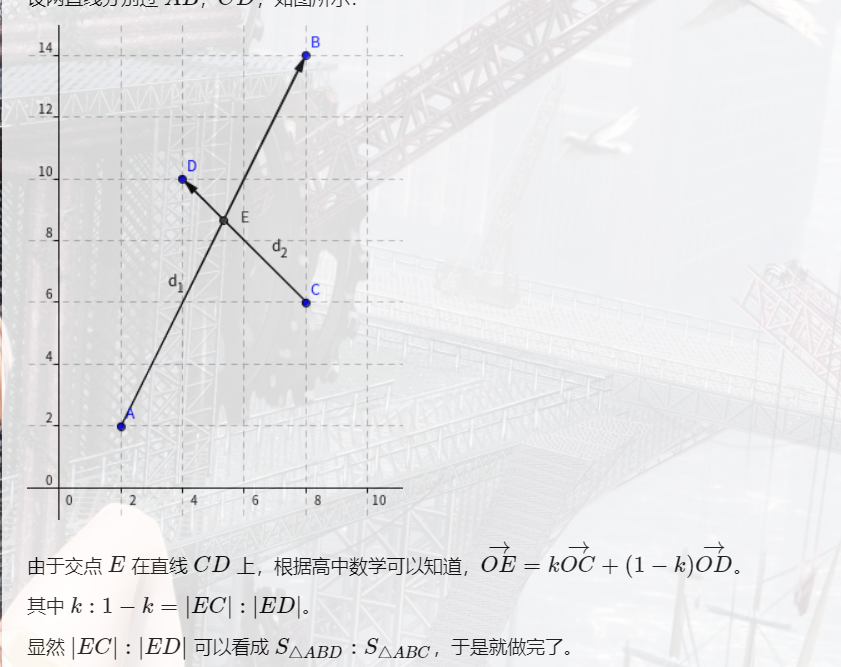

[TOC]


### 计算几何

#### 1.基础知识

正弦定理：$\frac a {sinA}=\frac b {sinB}=\frac c {sinC}=2R$

余弦定理：$a^2=b^2+c^2+2bc\:cosA$

C++函数：

$atan(x),acos(x),asin(x)$为反函数

$atan(y,x)$为$(x,y)$点的角度

```
#include<bits/stdc++.h>
using namespace std;
const int N=1e5+10;
const double PI=acos(-1),eps=1e-6;
#define Vector Point
struct Point{
    double x,y;
    Point(double x,double y):x(x),y(y){}
    Point operator +(const Point B)const{ return Point(x+B.x,y+B.y); }
    Point operator -(const Point B)const{ return Point(x-B.x,y-B.y); }
    Point operator *(const double B)const{ return Point(x*B,y*B); }
};
double sqr(double x){return x*x;}
double Cross(Point A,Point B){ return A.x*B.y-A.y*B.x; }//叉积
double cross(Point a,Point b,Point c){return (b.x-a.x)*(c.y-a.y)-(c.x-a.x)*(b.y-a.y);}
double Dot(Point A,Point B){ return A.x*B.x+A.y*B.y; }//点积
double Len(Point A){return sqrt(Dot(A,A));}//到原点的欧几里得距离
double Dis(Point A,Point B){return sqrt(sqr(A.x-B.x)+sqr(A.y-B.y));}//欧几里得距离
double Angle(Point A,Point B){return acos(Dot(A,B)/Len(A)/Len(B)); }//角度

//三态函数,克服浮点数精度陷阱,判断x==0?x<0?x>0?
int dcmp(double x){
    if (fabs(x)<eps)return 0;
    else return x < 0 ? -1 : 1;
}
signed main(){
    
    return 0;
}
```

#### 2.线段规范相交判定

叉积判断是否互为两端，护卫两端直线相交

```
bool SegmentProperIntersection(Point a1,Point a2,Point b1,Point b2){
    double c1=Cross(a2-a1,b1-a1),c2=Cross(a2-a1,b2-a1),c3=Cross(b2-b1,a1-b1),c4=Cross(b2-b1,a2-b1);
    return dcmp(c1)*dcmp(c2)<0&&dcmp(c3)*dcmp(c4)<0;
}
```

#### 3.判断点是否在多边形内部

1）射线判断

​		我们考虑以该点为端点引出一条射线，如果这条射线与多边形有奇数个交点，则该点在多边形内部，否则该点在多边形外部，我们简记为奇内偶外。这个算法同样被称为奇偶规则 ，就具体实现而言，可以把射线变成长的线段，然后对每一条边做跨立实验即可。 (实现细节多)

 2）夹角判断

​		我们把该点与多边形的所有顶点连接起来，计算相邻两边夹角的和。注意这里的夹角是有方向的。如果夹角和为0，则这个点在多边形外，否则夹角和为360，在多边形内。

3）面积判断

​		目标点与多边形每条边组成的三角形，面积之和等于多边形面积则在内部，否则在外部（原理与判断夹角类似，面积计算量更大）。

#### 4.求多边形面积与顺逆时针

1）选一个多边形的点为原点，每个点对于这个点有一个向量，将每一条边上两个端点的向量按同一个方向求叉积和的绝对值再除二

  $\frac 1 2 |\sum_{i=0}^{n-1}(x_iy_{i+1}-x_{i+1}y_i)|$(逆时针，值为正；顺时针，值为负)

2）三角形海伦公式：$S=\sqrt{p(p-a)(p-b)(p-c)},p=\frac{a+b+c}2$

3）皮克定理：给定顶点坐标均是整点的简单多边形，其面积S和内部格点数目n、多边形边界上的格点数目s的关系 $S=n+\frac s 2 -1$

#### 5.求两条直线的交点



```
Point GetLineIntersection(Point P,Vector v,Point Q,Vector w){
    Vector u=P-Q;
    double t=Cross(w,u)/Cross(v,w);
    return P+v*t;
}
```

#### 6.凸包

```
#include<bits/stdc++.h>
using namespace std;
const int N=1e5+10;
int n;
struct Point{
    int x,y;
}a[N];
bool cmp(Point a,Point b){
    if(a.y==b.y)return a.x<b.x;
    return a.y<b.y;
}
int sqr(int x){return x*x;}
double Dis(Point A,Point B){return sqrt(sqr(A.x-B.x)+sqr(A.y-B.y));}
int cross(Point a,Point b,Point c){return (b.x-a.x)*(c.y-a.y)-(c.x-a.x)*(b.y-a.y);}
double work(){
    if (n==1)return 0;
    else if (n==2)return Dis(a[1],a[2]);
    Point st[N];
    sort(a+1,a+1+n,cmp);
    for (int i=1;i<=3;i++)st[i]=a[i];
    int top=2;
    for (int i=3;i<=n;i++){
        while(top>1&&cross(a[i],st[top],st[top-1])>=0)top--;//左转退栈，上凸包
        st[++top]=a[i];
    }
    int len=top;	
    st[++top]=a[n-1];    
    for (int i=n-2;i>=1;i--){        
        while(top!=len&&cross(a[i],st[top],st[top-1])>=0)top--;//下凸包。            
        st[++top]=a[i];
    }
    double s=0;
    for (int i=2;i<=top;i++){
        s+=Dis(st[i],st[i+1>top?2:(i+1)]);
    }
    return s;
}
signed main(){
    while (scanf("%d",&n)==1&&n){
        for (int i=1;i<=n;i++)scanf("%d%d",&a[i].x,&a[i].y);
        printf("%.2lf\n",work());
    }
    return 0;
}
```

#### 7.半平面交

```
//(x–x1)*(y–y2)–(x–x2)*(y–y1)>=0,O(nlogn)
#include<bits/stdc++.h>
using namespace std;
const double eps=1e-8;
const int N=1e5+10;
struct Point{
    double x,y;
    Point(double x=0,double y=0):x(x),y(y){}
    Point operator+(const Point B)const{return Point(x+B.x,y+B.y);}
    Point operator-(const Point B)const{return Point(x-B.x,y-B.y);}
    double operator*(const Point B)const{return x*B.y-y*B.x;}
    Point operator*(const double B)const{return Point(x*B,y*B);}
}P[N];
struct Line{
    Point A,B;
    double ag;
    void cal(){
        ag=atan2(B.y-A.y,B.x-A.x);
    }
    bool operator<(const Line&nt)const{
        if(ag==nt.ag)return(nt.B-nt.A)*(B-nt.A)>0;
        return ag<nt.ag;
    }
}L[N];
int dcmp(double a){
    if(a>eps)return 1;
    if(a<-eps)return-1;
    return 0;
}
Point qp[N];
int q[N],l,r,n;
Point Ipt(Point p1,Point p2,Point p3,Point p4){
    Point u=p2-p1,v=p4-p3,w=p1-p3;
    return p1+(p2-p1)*((v*w)/(u*v));
}
signed main(){
    int tot;
    scanf("%d",&tot);
    for(int i=1;i<=tot;i++){
        scanf("%lf%lf%lf%lf",&L[i].A.x,&L[i].A.y,&L[i].B.x,&L[i].B.y);
        L[i].cal();
    }
    double lim=10000;//设定边界
    Point A={0,0},B={lim,0},C={lim,lim},D={0,lim};
    L[++tot].A=A,L[tot].B=B,L[tot].cal();
    L[++tot].A=B,L[tot].B=C,L[tot].cal();
    L[++tot].A=C,L[tot].B=D,L[tot].cal();
    L[++tot].A=D,L[tot].B=A,L[tot].cal();
    sort(L+1,L+1+tot);
    q[r++]=1;
    for(int i=2;i<=tot;i++)
        if(dcmp(L[i].ag-L[i-1].ag)){
            for(;r-l>=2&&dcmp((qp[r-2]-L[i].A)*(L[i].B-L[i].A))>=0;r--);
            for(;r-l>=2&&dcmp((qp[l]-L[i].A)*(L[i].B-L[i].A))>=0;l++);
            q[r++]=i;
            qp[r-2]=Ipt(L[i].A,L[i].B,L[q[r-2]].A,L[q[r-2]].B);
        }
    for(;r-l>=2&&dcmp((qp[r-2]-L[q[l]].A)*(L[q[l]].B-L[q[l]].A))>=0;r--);
    for(;r-l>=2&&dcmp((qp[l]-L[q[r-1]].A)*(L[q[r-1]].B-L[q[r-1]].A))>=0;l++);
    if(r-l<=2)puts("0.0");
    else{
        qp[r-1]=Ipt(L[q[l]].A,L[q[l]].B,L[q[r-1]].A,L[q[r-1]].B);
        qp[r]=qp[l];
        double ans=0;
        for(int i=l;i<r;i++){
            ans+=(qp[i]-qp[l])*(qp[i+1]-qp[l]);
        }
        printf("%.1f\n",fabs(ans*0.5));
    }
    return 0;
}
```

```
#include<bits/stdc++.h>
using namespace std;
int siz,cnt,n;
struct Point{
    double x,y;
    Point(){}
    Point(double x,double y):x(x),y(y){}
    Point operator-(const Point&B)const{return Point(x-B.x,y-B.y);}
    Point operator+(const Point&B)const{return Point(x+B.x,y+B.y);}
    double operator*(const Point&B)const{return x*B.y-y*B.x;}
    Point operator*(const double&B)const{return Point(x*B,y*B);}
}P[55],ret[505],tmp[505];
bool ERROR=0;
Point insec(Point A,Point B,Point C,Point D){
    ERROR=0;
    double a=(A-C)*(A-D),b=(B-D)*(B-C);
    if(a*b<0){ERROR=1;return Point(0,0);}
    return A+(B-A)*(a/(a+b));
}
void Cut(Point A,Point B){
    cnt=0;
    Point res;
    for(int i=0;i<siz;i++)
        if((A-ret[i])*(B-ret[i])<0){
            if((res=insec(ret[i],ret[(i-1+siz)%siz],A,B),ERROR)==0)
                tmp[cnt++]=res;
            if((res=insec(ret[i],ret[(i+1)%siz],A,B),ERROR)==0)
                tmp[cnt++]=res;
        }
        else tmp[cnt++]=ret[i];
    for(int i=0;i<cnt;i++)ret[i]=tmp[i];
    siz=cnt;
}
signed main(){
    int T;scanf("%d",&T);
    scanf("%d",&siz);
    for(int i=0;i<siz;i++)scanf("%lf%lf",&ret[i].x,&ret[i].y);
    for(T--;T--;){
        scanf("%d",&n);
        for(int i=0;i<n;i++)scanf("%lf%lf",&P[i].x,&P[i].y);
        for(int i=0;i<n;i++)
            Cut(P[i],P[(i+1)%n]);
    }
    if(siz<3){printf("0.000");return 0;}
    double ans=0;
    for(int i=0;i<siz;i++)ans+=ret[i]*ret[(i+1)%siz]*0.5;
    printf("%.3lf",fabs(ans));
    return 0;
}
```

